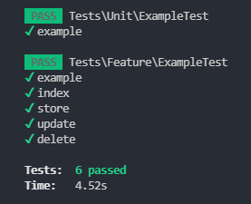

#  Testint en laravel para probar la API 2.0

Para continuar los testint pues ahora sigue lo que es el CRUD completo para eso lo que hacemos es lo siguiente:

Tanto como en la funcion store,update y destroy deseamos hacer consulta y pruebas para  determinar si son adecuados para su uso o no, pero en este caso solo queremos saber si  funcionan sin necesidad que hagan cambio en la base de datos, para esto lo que hacemos de  una forma sencilla es modificar sus funciones en el controlador, en el caso de la funcion store  sustituimos el metodo create por make ya que el create me creaba un nuevo dato es decir crea  instancia del modelo e inserta a la base de datos en cambio make crea la instacia tambien pero  no ejecuta cambio en la Base de datos

Tambien la funcion update como la store esta tambien sustituimos el metodo update por make  ya que el update edita o actualiza un nuevo dato es decir modifica la instancia del modelo e inserta  los datos nuevo a la base de datos en cambio make crea la instacia tambien pero no ejecuta cambio  en la Base de datos, por ultimo en el metodo destroy hacemos lo mismo sustituimos delete por  make para que no haga modificacion en la bade de datos.

Ahora nos vamos a crear las funciones para probar los test, a como podemos ver en la  captura en la parte inferior las funciones son iguales que la ves anterior pues ellas  no cambian nada ya que solo estan probando si es la forma correcta.

Por ultimo podemos ver como resultado que nos da el check que todo esta correcto, very good.

